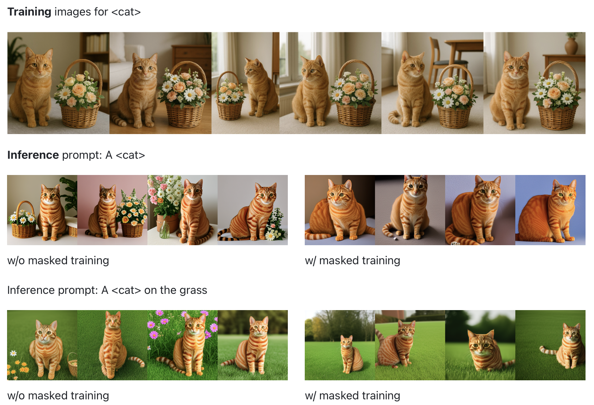
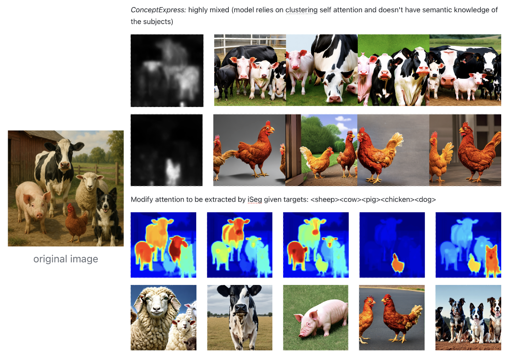

# Personalized 2D Generation with Attention Refinement

This repo provides two applications with refined attention, showcasing the importance of attention map on personalized 2D generation tasks. This work is done as my research skill training for 2D AIGC.

I tackle two key problems:
1. **Background Leakage in Personalized Subject Learning and Generation**  

2. **Multi-Subject Extraction from a Single Image**  

---

## 📂 Components

### `train_svd.py` – Subject-Only SVDiff Training (No Background Leakage)
- Fine-tunes SVDiff weights on personalized images.
- Uses refined attention maps to isolate the subject from the background and only compute loss inside the mask to update weights.

**Key features:**
- Plug-and-play with Stable Diffusion pipelines.
- Can choose between YOLO+SAM masks or refined attention masks (adapted from *iSeg*) for training.
- Designed to prevent background content from contaminating subject embeddings.


### `train.py` – Multi-Subject Extraction from a Single Image
- Identifies and separates multiple subjects in a single image given user defined targets.
- Enables controllable multi-subject generation through prompt composition.

**Key features:**
- Supports simultaneous token learning for multiple subjects.
- Better results than *ConceptExpress* (automatic extraction of subject lack semantic guidance and cannot provide clean separations).



---

## 🚀 Getting Started

1. Clone the repo
2. Prepare your dataset and prompts
3. Choose your training script:
   - For personalized LoRA training with refined masks:  
     ```bash
        export MODEL_NAME="MODEL_NAME"
        export INSTANCE_DIR="INSTANCE_DIR"
        export OUTPUT_DIR="OUTPUT_DIR"

        accelerate launch train_svd.py \
        --pretrained_model_name_or_path=$MODEL_NAME  \
        --instance_data_dir=$INSTANCE_DIR \
        --output_dir=$OUTPUT_DIR \
        --instance_prompt="a sks chicken"  \
        --resolution=512 \
        --train_batch_size=1 \
        --gradient_accumulation_steps=1 \
        --learning_rate=1e-3 \
        --learning_rate_1d=1e-6 \
        --train_text_encoder \
        --lr_scheduler="constant" \
        --lr_warmup_steps=0 \
        --num_class_images=200 \
        --max_train_steps=500 \
        --use_sam_mask \
        --subject_name="dog"
     ```
   - For multi-subject concept extraction from a single image:  
     ```bash
     bash scripts/train.py
     ```

---

## 📌 Acknowledgements
- Thank you for the amazing works of SVDiff, ConceptExpress, and iSeg!

